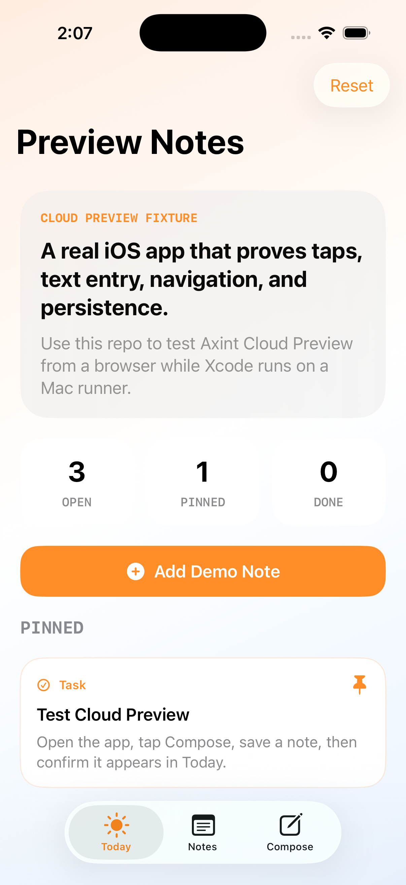

# Axint Preview Notes

A small SwiftUI iOS app built to test Axint Cloud Preview with a real native interface.

It gives Cloud Preview a real app to build, launch, tap, type into, and verify:

- Three tabs: Today, Notes, Compose
- Buttons that mutate visible state
- Text input and save flow
- Local persistence through `UserDefaults`
- Accessibility identifiers for automation



## Build Locally

```bash
xcodebuild \
  -project AxintPreviewNotes.xcodeproj \
  -scheme AxintPreviewNotes \
  -destination 'platform=iOS Simulator,name=iPhone 17 Pro' \
  build
```

## Cloud Preview Values

Use these when creating a Cloud Preview room:

- App name: `Axint Preview Notes`
- Scheme: `AxintPreviewNotes`
- Branch: `main`
- Simulator: `iPhone 17 Pro`

## What To Test

1. Open the app.
2. Tap the `Compose` tab.
3. Type a title and body.
4. Tap `Save Note`.
5. Switch to `Today` or `Notes` and confirm the new note appears.

## Automation Targets

Useful accessibility identifiers:

- `tab.today`
- `tab.notes`
- `tab.compose`
- `button.add-demo-note`
- `button.reset-demo`
- `field.note-title`
- `field.note-body`
- `picker.note-category`
- `button.save-note`
- `text.saved-message`

## Proof From This Repo

This fixture has already been checked locally with:

```bash
axint validate-swift AxintPreviewNotes/*.swift

xcodebuild \
  -project AxintPreviewNotes.xcodeproj \
  -scheme AxintPreviewNotes \
  -destination 'platform=iOS Simulator,name=iPhone 17 Pro,OS=26.4.1' \
  build
```

Both passed on Xcode 26.4.1.
