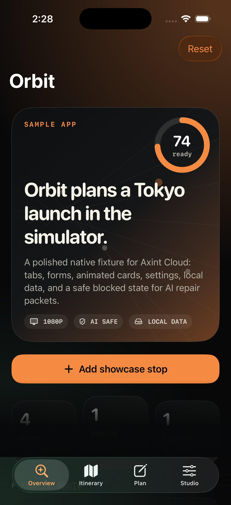

# Orbit

A premium SwiftUI iOS sample app built to make Axint Cloud Preview feel like a real Apple execution layer, not a toy notes demo.

Orbit gives Cloud Preview a polished app to build, launch, stream, tap, type into, record, and verify:

- Four tabs: Overview, Itinerary, Plan, Studio
- Animated hero map, route cards, metrics, and status pills
- A real form with text entry, segmented pickers, save flow, and visible state updates
- Local persistence through `UserDefaults`
- Safe AI walkthrough controls, artifacts, and a deliberate blocked state for repair packets
- Accessibility identifiers for automation



## Build Locally

```bash
xcodebuild \
  -project AxintPreviewNotes.xcodeproj \
  -scheme AxintPreviewNotes \
  -destination 'platform=iOS Simulator,name=iPhone 17 Pro' \
  build
```

## Cloud Preview Values

Use these when creating a Cloud Preview room:

- App name: `Orbit`
- Scheme: `AxintPreviewNotes`
- Branch: `main`
- Simulator: `iPhone 17 Pro`

## What To Test

1. Open the app.
2. Tap the `Plan` tab.
3. Tap `Fill premium draft`.
4. Tap `Save stop`.
5. Switch to `Itinerary` and confirm the new stop appears.
6. Tap `Studio` and confirm the safe AI walkthrough controls and artifacts panel are available.

## Automation Targets

Useful accessibility identifiers:

- `button.add-showcase-stop`
- `button.reset-demo`
- `button.reset-showcase-data`
- `field.stop-title`
- `field.stop-location`
- `field.stop-detail`
- `picker.stop-category`
- `picker.stop-status`
- `button.fill-demo-draft`
- `button.save-stop`
- `text.saved-message`
- `toggle.agent-walkthrough`
- `toggle.focus-mode`
- `picker.region`
- `panel.artifacts`

## Proof From This Repo

This fixture has already been checked locally with:

```bash
axint validate-swift AxintPreviewNotes/*.swift

xcodebuild \
  -project AxintPreviewNotes.xcodeproj \
  -scheme AxintPreviewNotes \
  -destination 'platform=iOS Simulator,name=iPhone 17 Pro,OS=26.4.1' \
  build
```

Both passed on Xcode 26.4.1.
